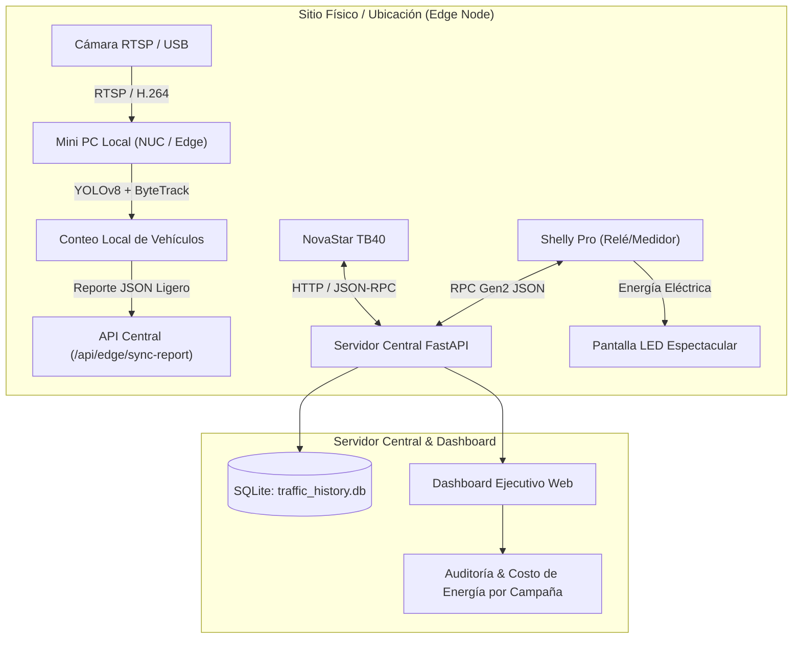

# 🚗 Traffic Vision Analytics & DOOH Smart Control

Plataforma corporativa de **auditoría de tráfico vehicular (aforo multicámara con IA)**, **control inteligente de pantallas NovaStar Taurus TB40**, **monitoreo de telemetría eléctrica Shelly Pro** y **contabilidad energética por campaña publicitaria (DOOH)**.

---

## 🌟 Características Principales

### 1. 🎯 Auditoría y Aforo Vehicular en Tiempo Real
- Detección y seguimiento multiobjeto con **YOLOv8 + ByteTrack**.
- Clasificación de 5 categorías vehiculares: **Automóvil, Camión, Autobús, Motocicleta y Bicicleta**.
- Conteo direccional bidireccional (**Entrada / Salida**) con cálculo de tiempo de permanencia (*dwell time*).
- Panel ejecutivo histórico con métricas por hora, picos de aforo, tendencia de 7 días y exportación directa en formato **CSV**.

### 2. ⚡ Arquitectura Edge Multi-Ubicación de Bajo Costo
- **Procesamiento 100% Local**: Las computadoras o mini PCs (NUCs/Edge AI) instaladas en cada ubicación procesan el stream de video de las cámaras localmente usando CPU/NPU/GPU.
- **Cero Costos de Ancho de Banda**: **No se transmiten streams de video a la nube ni a servidores centrales**. Las computadoras locales solo envían reportes ligeros en formato JSON mediante la API de sincronización `/api/edge/sync-report`.
- **Soporte Multi-Pantalla**: Selector dinámico de ubicaciones para gestionar múltiples sitios DOOH de forma centralizada.

### 3. 📺 Integración y Control con NovaStar Taurus TB40
- Control y consulta de estado del reproductor multimedia **NovaStar TB40** vía API HTTP / JSON-RPC.
- Encendido y apagado lógico de la pantalla (*Screen Standby / Wake*).
- Ajuste y modulación de brillo dinámico (0% a 100%).
- Modo de simulación resiliente para desarrollo y pruebas cuando no hay conexión directa a la subred física del reproductor.

### 4. 🔌 Monitoreo Eléctrico y Encendido con Shelly Pro
- Control de contactores y relevadores de potencia física mediante la API RPC Gen2/Gen3 de **Shelly Pro** (`/rpc/Switch.Set`).
- Telemetría en vivo: **Potencia activa (Watts)**, **Voltaje de línea (V)**, **Corriente (Amperes)**, **Consumo acumulado (kWh)** y temperatura interna.
- Apagado y encendido programado o de emergencia para protección de módulos LED.

### 5. 💰 Contabilidad y Métricas de Energía por Campaña
- Asignación de aforo e impresiones vehiculares efectivas a cada campaña publicitaria según sus horarios de transmisión y vigencia.
- Cálculo de horas de emisión en pantalla con base en duración de spot (ej. 15s, 20s) y frecuencia de pautas por hora.
- Estimación precisa de energía consumida (**kWh**) por campaña y desglose de costo financiero en **$ MXN** con la tarifa contratada (ej. CFE Gran Demanda / Media Tensión).
- Indicador **CPM Energético** (Costo de energía eléctrica por cada 1,000 impactos vehiculares).

### 6. ☀️ Calendario y Regulación de Brillo Solar por Orientación Geográfica
- **Cálculo Astronómico Autónomo**: Determina en tiempo real la elevación y azimut solar a partir de las coordenadas (latitud y longitud) sin depender de APIs de terceros.
- **Incidencia Frontal según Azimut de la Pantalla**:
  - Pantallas orientadas al **Este / Oriente (90°)**: Elevan su brillo a su punto máximo durante las horas de la mañana (08:00 - 10:30 hrs).
  - Pantallas orientadas al **Oeste / Poniente (270°)**: Alcanzan su pico de brillo durante la tarde (15:30 - 18:30 hrs) ante el sol rasante.
  - Sombra e iluminación difusa: Disminución inteligente del brillo a niveles moderados (**60% - 70%**) para ahorrar energía cuando el sol está detrás de la pantalla.
  - Noche y crepúsculo: Reducción automática a niveles de seguridad vial (**20% - 25%**) para evitar deslumbramiento a conductores y abatir el costo del recibo eléctrico.
- **Curva Horaria 24h Interactiva**: Gráfica en tiempo real con 48 puntos de proyección diaria y selector visual de ángulo de orientación.

---

## 🏗️ Arquitectura del Sistema



---

## 🚀 Instalación y Ejecución Local

### Prerrequisitos
- Python 3.10 o superior.
- Git.

### 1. Clonar el Repositorio
```bash
git clone https://github.com/Alejandrino/traffic-vision-analytics.git
cd traffic-vision-analytics
```

### 2. Configurar Entorno Virtual e Instalar Dependencias
```bash
python -m venv .venv
.\.venv\Scripts\Activate.ps1
pip install -r requirements.txt
```

### 3. Iniciar la Plataforma
```bash
powershell -ExecutionPolicy Bypass -File .\run.ps1
```
El panel estará disponible de inmediato en: **`http://localhost:8000`**.

---

## 📡 Endpoints de API Principales

| Endpoint | Método | Descripción |
|---|---|---|
| `/api/locations` | `GET` | Lista de ubicaciones y sitios de pantallas con configuración técnica. |
| `/api/shelly/status` | `GET` | Telemetría eléctrica en tiempo real (W, V, A, kWh) del Shelly Pro. |
| `/api/shelly/power` | `POST` | Control de encendido/apagado del relevador Shelly Pro. |
| `/api/novastar/status` | `GET` | Estado de conexión, standby y brillo del NovaStar TB40. |
| `/api/novastar/power` | `POST` | Encendido/apagado de la pantalla NovaStar TB40. |
| `/api/novastar/brightness` | `POST` | Regulación del nivel de brillo (0 - 100%) del TB40. |
| `/api/solar/status` | `GET` | Posición solar actual y nivel de brillo recomendado por orientación. |
| `/api/solar/schedule` | `GET` | Calendario y proyección horaria solar de brillo para 24 horas. |
| `/api/solar/config` | `POST` | Actualización de orientación (° azimut) y modo solar automático. |
| `/api/solar/apply-now` | `POST` | Ajuste forzado inmediato de brillo solar al NovaStar TB40. |
| `/api/campaigns` | `GET` / `POST` | Consulta y registro de campañas publicitarias activas. |
| `/api/campaigns/summary` | `GET` | Métricas de aforo expuesto, kWh consumidos y costo eléctrico por campaña. |
| `/api/edge/sync-report` | `POST` | Recepción de reportes de aforo ligero desde nodos Edge sin enviar video. |
| `/api/history/summary` | `GET` | Resumen ejecutivo de aforo, horas pico y permanencia. |
| `/api/history/export/csv` | `GET` | Descarga de auditoría en formato CSV para clientes y anunciantes. |

---

## 🔒 Licencia
Uso corporativo y comercial autorizado.
